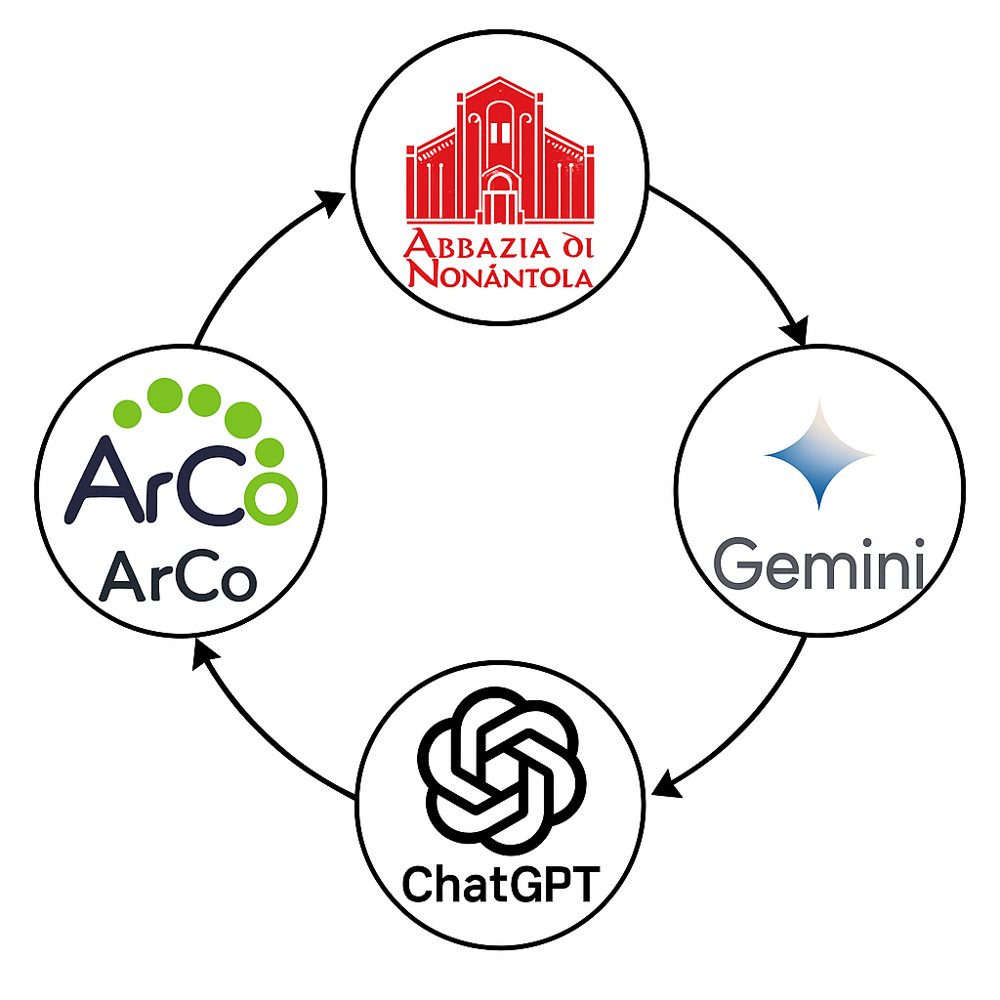

  <a href="index.html">🏠 Home</a> |
  <a href="topic.html">🏛️ Topic</a> |
  <a href="sparql.html">📊 SPARQL&Results</a> |
  <a href="gaps.html">🔍 Identifying Gaps</a> |
  <a href="prompts.html">💬 LLM Prompts</a> |
  <a href="rdf.html">🔗 RDF Triples</a> |
  <a href="challenges.html">⚠️ Challenges</a> |
  <a href="conclusion.html">✅ Conclusion</a>

# Methodology

Our project followed a structured and multi-step methodology to explore and enrich the knowledge about [**Abbazia di Nonantola**](https://dati.beniculturali.it/lodview-arco/resource/HistoricOrArtisticProperty/0100210793.html) using the [**ArCo**](http://wit.istc.cnr.it/arco/) Knowledge Graph and Large Language Models.

## Step-by-step process:

1. **Selecting the Topic**  
   We chose a cultural heritage site that we believed could benefit from additional knowledge and visibility.

2. **Exploring the ArCo Ontologies**  
   We used the [ArCo SPARQL endpoint](https://dati.cultura.gov.it/sparql) to find existing data about our topic within the ArCo ontologies.

3. **Building SPARQL Queries**  
   We developed several SPARQL queries using essential keywords to retrieve relevant information about [Abbazia di Nonantola](https://dati.beniculturali.it/lodview-arco/resource/HistoricOrArtisticProperty/0100210793.html).

4. **Analyzing the Query Results**  
   We carefully examined the output to understand what is already present in [ArCo](http://wit.istc.cnr.it/arco/) and what might be missing.

5. **Identifying Knowledge Gaps**  
   We evaluated the documentation to detect where the information could be improved or extended.

6. **Prompt Engineering for LLMs**  
   We crafted prompts using three prompting strategies to extract new facts from [Gemini](https://gemini.google.com/app) and [Chat GPT](https://chatgpt.com/).

7. **Comparing LLM Outputs**  
   We analyzed and compared the answers provided by the two language models to ensure consistency and richness.

8. **RDF Enrichment**  
   We transformed relevant LLM outputs into RDF triples using ArCo-compliant structure and vocabulary.

9. **Triple Design**  
   We designed the final RDF triples to reflect the new insights, formatted according to ArCo's ontological model.

10. **Website Creation**  
   We implemented the website using GitHub Pages to present our project in an accessible and visually structured format.

11. **Publishing Online**  
   The final website was published as an open educational resource, enabling others to explore and reuse our findings.
