<div style="text-align: center; margin-bottom: 20px;">
  <a href="index.html">🏠 Home</a> |
  <a href="topic.html">🏛️ Topic</a> |
  <a href="methodology.html">⚒️ Methodology</a> |
  <a href="sparql.html">📊 SPARQL&Results</a> |
  <a href="gaps.html">🔍 Identifying Gaps</a> |
  <a href="prompts.html">💬 LLM Prompts</a> |
  <a href="challenges.html">⚠️ Challenges</a> |
  <a href="conclusion.html">✅ Conclusion</a>
</div>

---

# Generating our new triples

## 1. Triple of the first missing information

It is important to mention that since the Abbazia di Nonantola is not present in ArCo as an `ArchitecturalHeritage` (a subclass of `arco:ImmovableCulturalProperty`), we were only able to find **representations** of it. For this reason, in the following series of triples, we chose the IRI:  
`https://w3id.org/arco/resource/HistoricOrArtisticProperty/0100210793`  
Among the two results retrieved as cultural properties with the mention “Abbazia di Nonantola” in the title, this one is the closest representation of the abbey. The other refers only to an affixed element, a component of the artistic complex.

---

### Few-shot prompt for LLMs

We showed the following example prompt:

> **Subject:** [Michelangelo Buonarroti](https://w3id.org/arco/resource/Agent/56d8ee32618291c12ae4f357db49c221)  
> **Predicate:** `a-cd:alternativeName`  
> **Object:** "Michelangelo di Lodovico Buonarroti Simoni"  
>  
> Based on the previous example that I gave you, could you create an RDF triple for the following sentence: “Abbazia di Nonantola has the alternative denomination of “Abbazia di San Silvestro”? Note that:  
> - Abbazia di Nonantola IRI is: https://w3id.org/arco/resource/HistoricOrArtisticProperty/0100210793  
> - the predicate a-cd:alternativeName is referred only to a person in the Arco ontologies, so find the correct predicate in the Arco ontologies or propose a new one if it is not present.  
> - the “Abbazia di San Silvestro” has to be put as literal.

---

### [ChatGPT](https://chatgpt.com/)

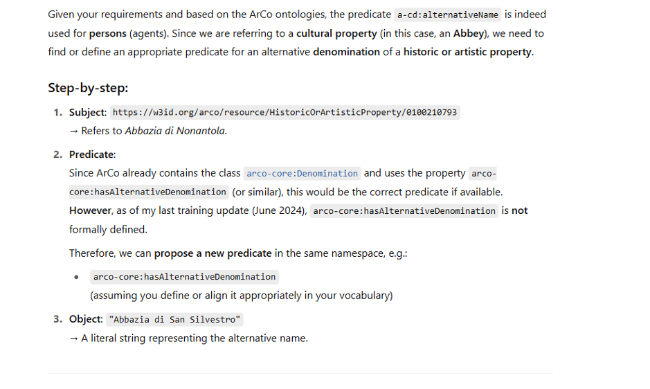 

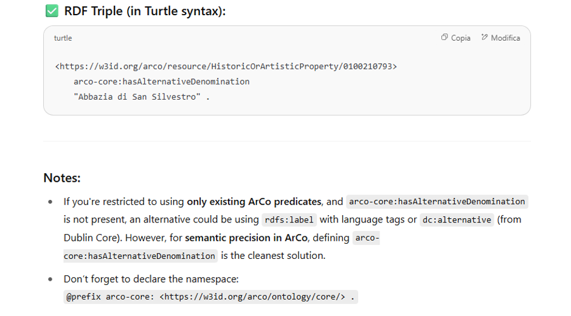 

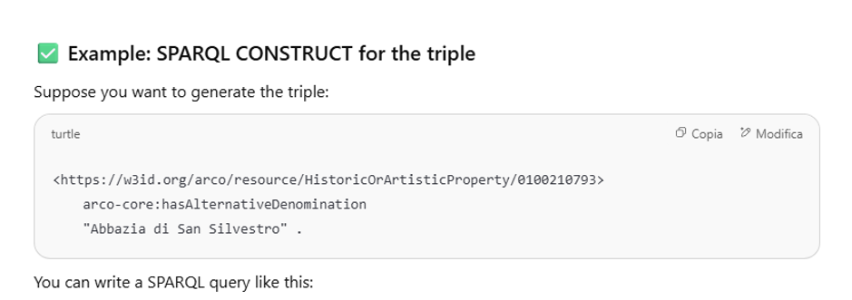 

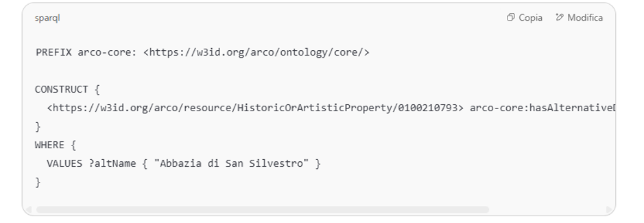

**Copy of the SPARQL CONSTRUCT query generated by ChatGPT:**

```sparql
PREFIX arco-core: <https://w3id.org/arco/ontology/core/>

CONSTRUCT {
  <https://w3id.org/arco/resource/HistoricOrArtisticProperty/0100210793> arco-core:hasAlternativeDenomination ?altName .
}
WHERE {
  VALUES ?altName { "Abbazia di San Silvestro" }
}
```

### SPARQL result using ChatGPT’s query:

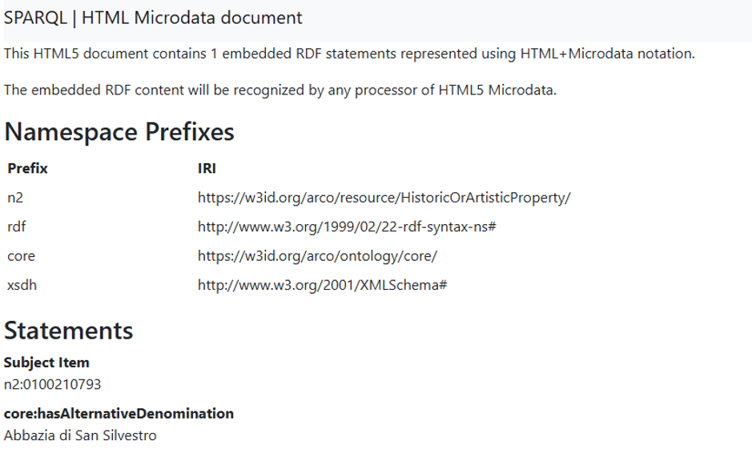

### [Gemini](https://gemini.google.com/app):

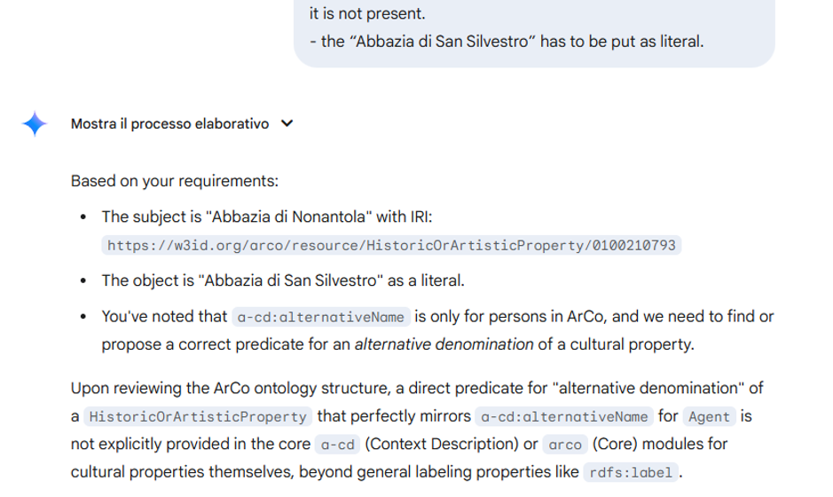

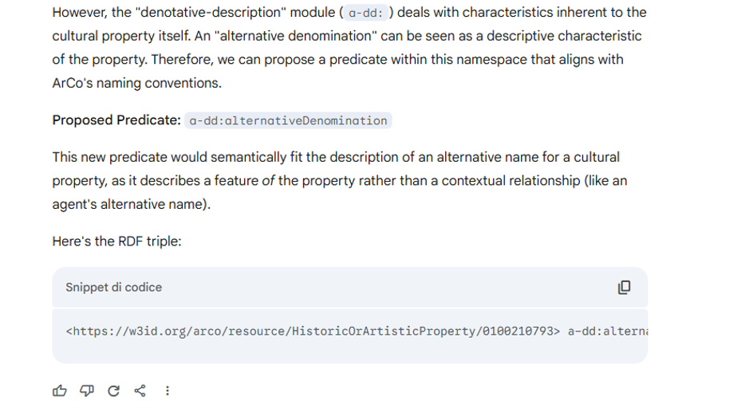

### Code generated by Gemini:

<https://w3id.org/arco/resource/HistoricOrArtisticProperty/0100210793> a-dd:alternativeDenomination "Abbazia di San Silvestro" .


## 2. Triple of the second missing information

### Chain-of-thought prompting technique

We asked the LLM the following:

> Could you create an RDF triple using ArCo ontologies for the following sentence:  
> **“Sant’Anselmo has commissioned the Abbazia di Nonantola”**,  
> knowing that:  
> - IRI of Abbazia di Nonantola: `https://w3id.org/arco/resource/HistoricOrArtisticProperty/0100210793`  
> - Predicate: `a-cd:hasCommittent` (from ArCo ontologies)  
> - IRI for "Sant’Anselmo di Nonantola" does **not** exist in ArCo, so we need to propose a custom IRI.  
> Also, please build the corresponding SPARQL CONSTRUCT query.  
> **Let’s think step by step.**

---

### [ChatGPT](https://chatgpt.com/)

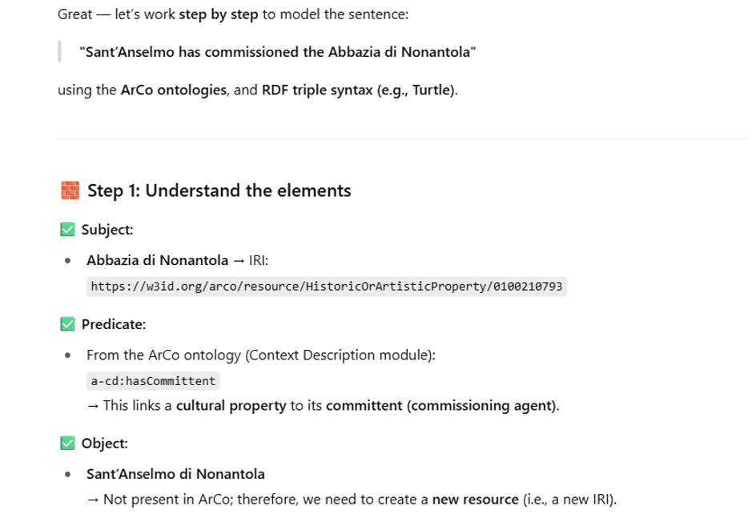  

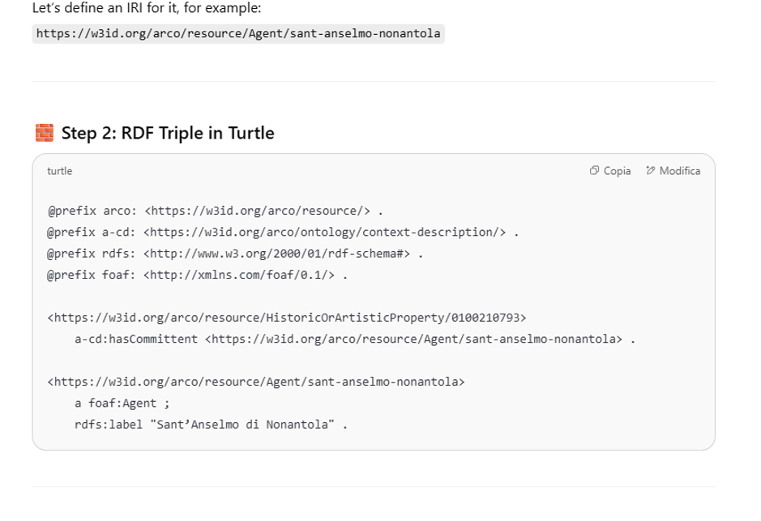  

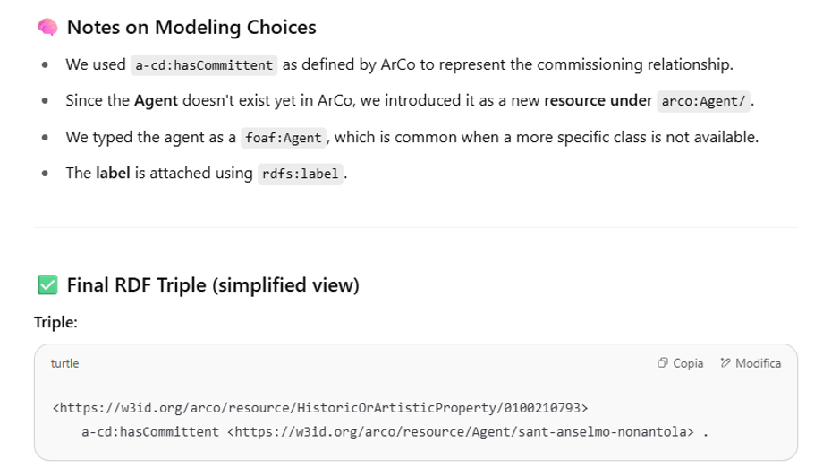

**Generated RDF triple:**

```turtle
<https://w3id.org/arco/resource/HistoricOrArtisticProperty/0100210793>
    a-cd:hasCommittent <https://w3id.org/arco/resource/Agent/sant-anselmo-nonantola> .
```

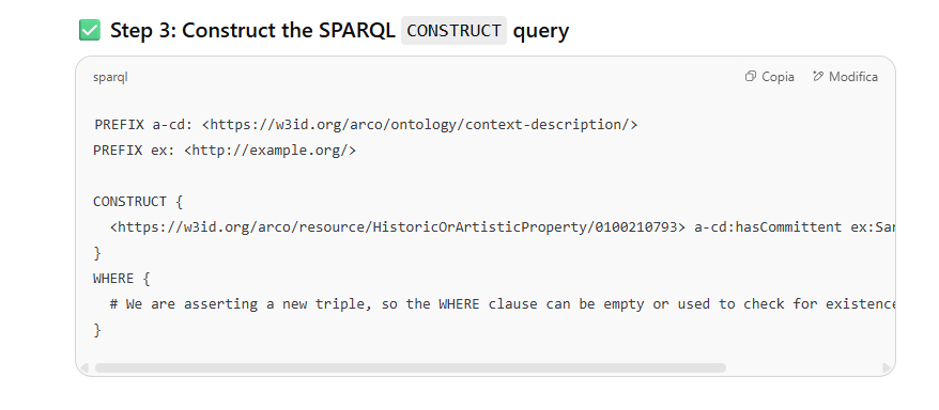

### SPARQL CONSTRUCT query:

```sparql
PREFIX a-cd: <https://w3id.org/arco/ontology/context-description/>
PREFIX ex: <http://example.org/>

CONSTRUCT {
  <https://w3id.org/arco/resource/HistoricOrArtisticProperty/0100210793> 
      a-cd:hasCommittent ex:SantAnselmoDiNonantola .
}
WHERE {
  # We are asserting a new triple, so the WHERE clause can be empty or used to check for existence
}
```

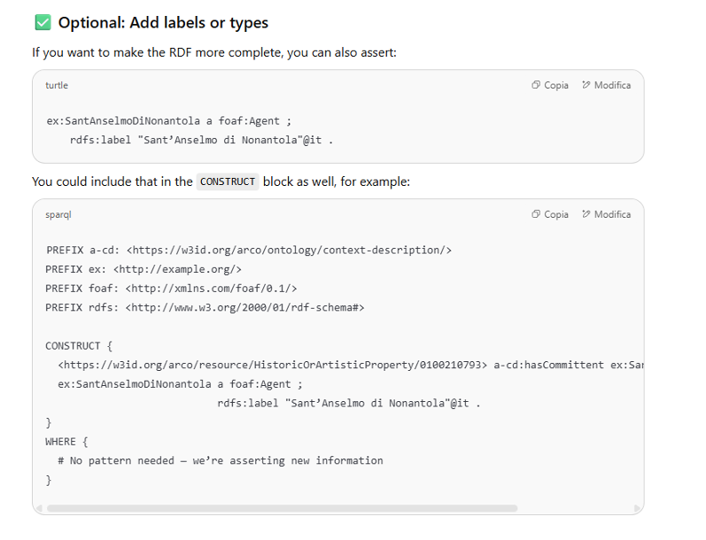

### SPARQL RESULT USING CHAT GPT LAST CONSTRUCT QUERY:

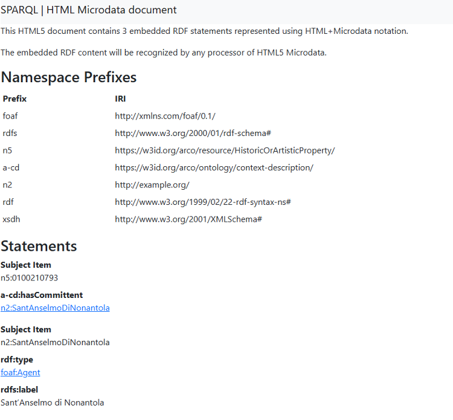

### [Gemini](https://gemini.google.com/app)

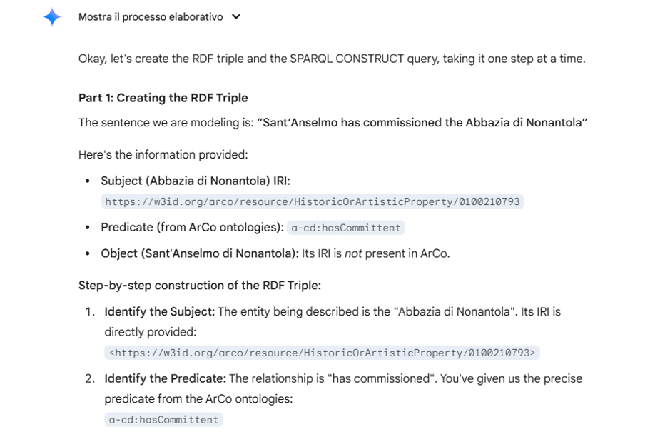

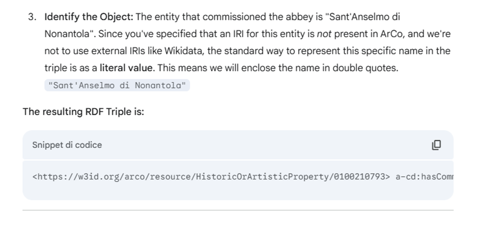

### COPY OF THE RDF TRIPLE:
```turtle
<https://w3id.org/arco/resource/HistoricOrArtisticProperty/0100210793> a-cd:hasCommittent "Sant'Anselmo di Nonantola" .

```

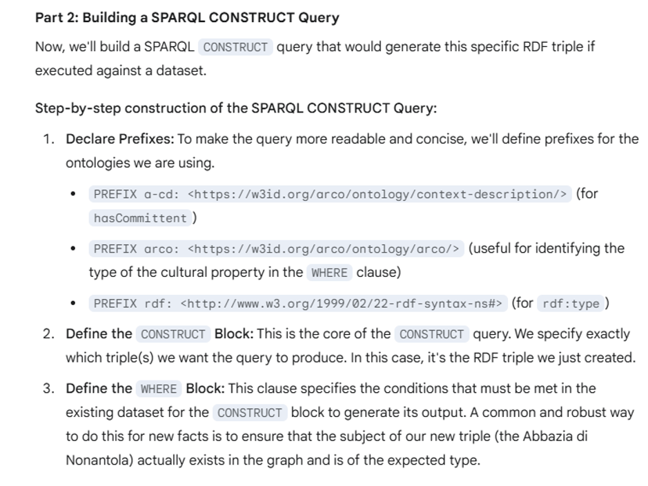

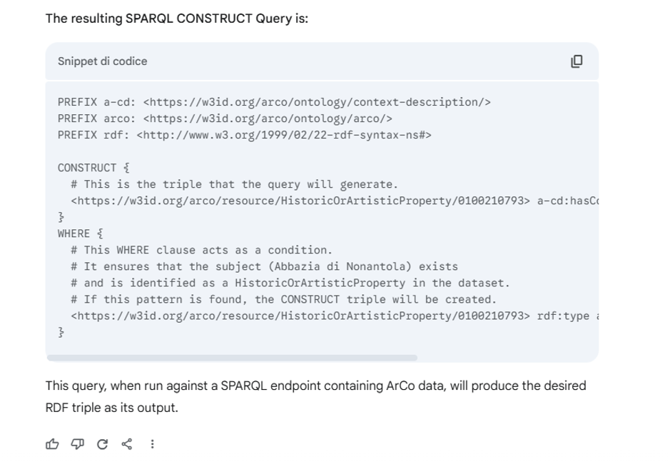

### Copy of the query:

```sparql
PREFIX a-cd: <https://w3id.org/arco/ontology/context-description/>
PREFIX arco: <https://w3id.org/arco/ontology/arco/>
PREFIX rdf: <http://www.w3.org/1999/02/22-rdf-syntax-ns#>
 
CONSTRUCT {
  # This is the triple that the query will generate.
  <https://w3id.org/arco/resource/HistoricOrArtisticProperty/0100210793> a-cd:hasCommittent "Sant'Anselmo di Nonantola" .
}
WHERE {
  # This WHERE clause acts as a condition.
  # It ensures that the subject (Abbazia di Nonantola) exists
  # and is identified as a HistoricOrArtisticProperty in the dataset.
  # If this pattern is found, the CONSTRUCT triple will be created.
  <https://w3id.org/arco/resource/HistoricOrArtisticProperty/0100210793> rdf:type arco:HistoricOrArtisticProperty .
}
```

### SPARQL RESULT USING GEMINI CONSTRUCT QUERY:

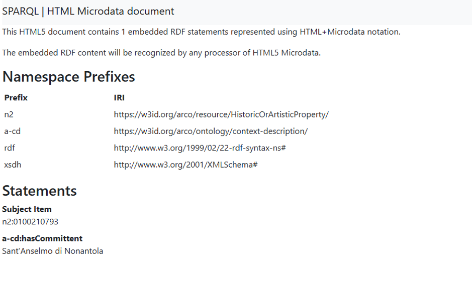


## 3. Triple of the third missing information

We decided to create two triples with two examples of inscriptions that can be found engraved in the Abbazia di Nonantola, one suggested by Chat GPT and the other by Gemini. For these triples we used as subject for the Abbazia di Nonantola another IRI depicting the abbey from the front, as the incriptions are affixed on the main portal.

### 3.1 CONSTRUCTION OF THE TRIPLE FOR THE INSCRIPTION: “Hic locus Domini est, firmiter fundatus est”

### Few-shot prompting technique:

*Example triple 1:*

> Subject: veduta della piazza e della basilica di San Pietro in Vaticano (stampa, elemento d'insieme) di Falda Giovan Battista (sec. XVII)
> `https://w3id.org/arco/resource/HistoricOrArtisticProperty/0900476442`
> 
> Predicate: `a-dd:hasAffixedElement`
> 
> Object: Iscrizione 3 sul bene culturale 0900476442 `https://w3id.org/arco/resource/Inscription/0900476442-inscription-3`

*Example triple 2:*

> Subject: `https://w3id.org/arco/resource/Inscription/0900476442-inscription-3`
> 
> Predicate: `a-dd:positionOnCulturalProperty`
> 
> Object: in basso nel centro

*Example triple 3:*

> Subject: `https://w3id.org/arco/resource/Inscription/0900476442-inscription-3`
> 
> Predicate: `a-dd:transcript`
> 
> Object: Per Gio(vanni) Giacomo Rossi in Roma alla Pace con P(rivilegio) del S(ommo) P(ontefice)

*Example triple 4:*

> Subject: `https://w3id.org/arco/resource/Inscription/0900476442-inscription-3`
> 
> Predicate: `rdf:type`
> 
> Object: a-dd:Inscription                                                                                               

> Please, could you transform the following information into RDF format and use Arco ontology taking the previous triples as examples?
> 
> “The Abbazia di Nonantola has affixed the element ‘Iscrizione 1 sul bene culturale 0800634107’, that this element has a transcription which is ”Hic locus > Domini est, firmiter fundatus est” and it is engraved on the portal archivolt.”
> Note that:
> -	 the IRI of the subject (Abbazia di Nonantola) is https://w3id.org/arco/resource/PhotographicHeritage/0800634107
> -	The IRI of the “Iscrizione sul bene culturale 0800634107” does not exist in Arco

---

[ChatGPT](https://chatgpt.com/)


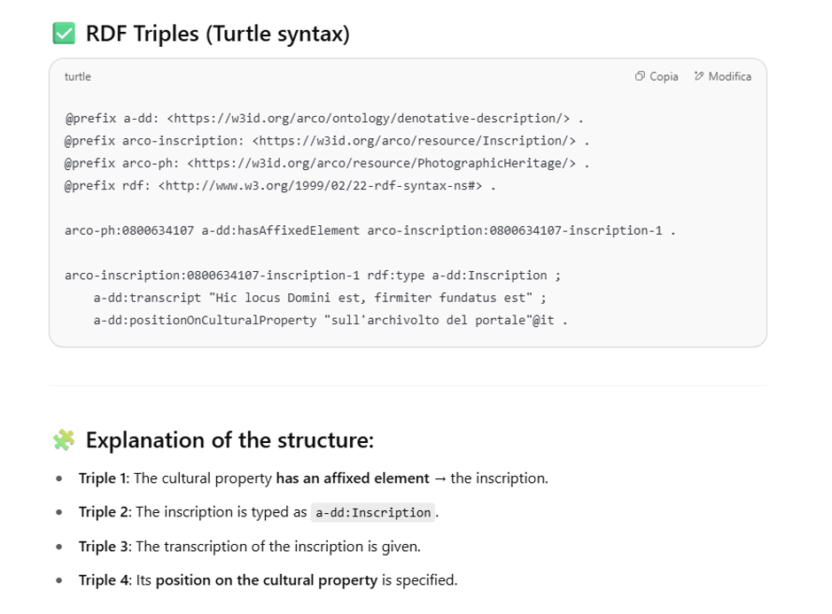

### COPY OF THE TRIPLE:

```sparql
@prefix a-dd: <https://w3id.org/arco/ontology/denotative-description/> .
@prefix arco-inscription: <https://w3id.org/arco/resource/Inscription/> .
@prefix arco-ph: <https://w3id.org/arco/resource/PhotographicHeritage/> .
@prefix rdf: <http://www.w3.org/1999/02/22-rdf-syntax-ns#> .
 
arco-ph:0800634107 a-dd:hasAffixedElement arco-inscription:0800634107-inscription-1 .
 
arco-inscription:0800634107-inscription-1 rdf:type a-dd:Inscription ;
    a-dd:transcript "Hic locus Domini est, firmiter fundatus est" ;
    a-dd:positionOnCulturalProperty "sull'archivolto del portale"@it .
```

[Gemini](https://gemini.google.com/app)

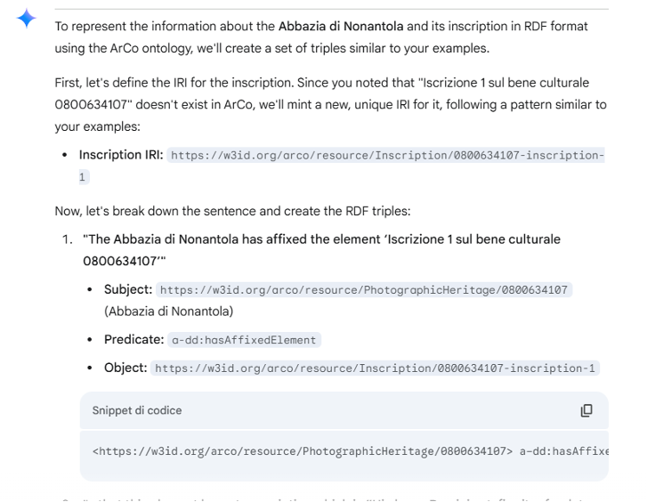

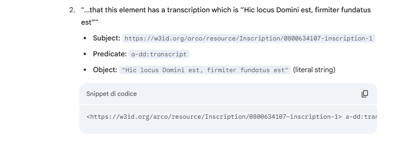

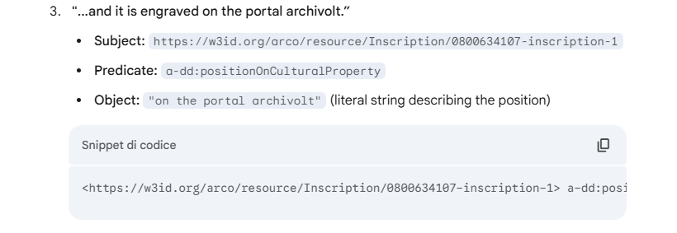

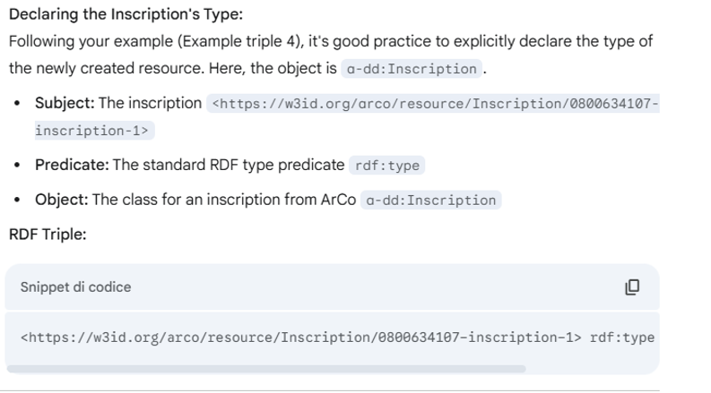

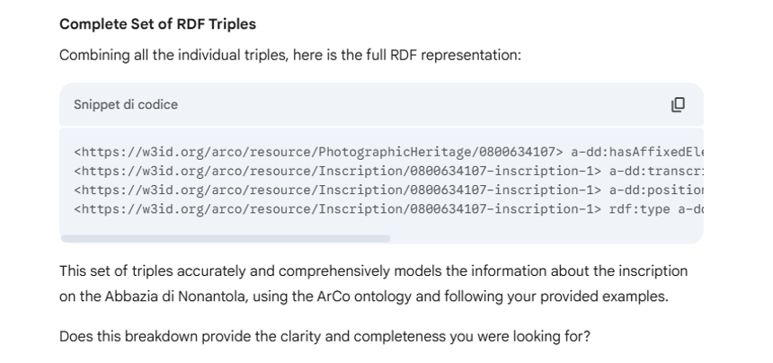

### COPY OF THE CODES:

```sparql
<https://w3id.org/arco/resource/PhotographicHeritage/0800634107> a-dd:hasAffixedElement <https://w3id.org/arco/resource/Inscription/0800634107-inscription-1> .
<https://w3id.org/arco/resource/Inscription/0800634107-inscription-1> a-dd:transcript "Hic locus Domini est, firmiter fundatus est" .
<https://w3id.org/arco/resource/Inscription/0800634107-inscription-1> a-dd:positionOnCulturalProperty "on the portal archivolt" .
<https://w3id.org/arco/resource/Inscription/0800634107-inscription-1> rdf:type a-dd:Inscription .
```

### 3.2 CONSTRUCTION OF THE TRIPLE FOR THE INSCRIPTION: “Altæ fornices templi conlapsæ sunt anno millesimo centesimo septimo decimo a nativitate Redemptoris, et quattuor annis postea restaurari cœptæ sunt. 

For the construction of the triple about the second inscription we wanted to use the other methodology, SPARQL CONSTRUCT query, always with the LLMs’ help. 

### Zero-shot prompting technique

> Could you transform also the following information into a SPARQL CONSTRUCT query using Arco ontology? Our objective is to create new triples with the following > information:

> “The Abbazia di Nonantola has affixed the element ‘Iscrizione 2 sul bene culturale 0800634107’, that this element has a transcription which is ” Altæ fornices > templi conlapsæ sunt anno millesimo centesimo septimo decimo a nativitate Redemptoris, et quattuor annis postea restaurari cœptæ sunt.” and it is engraved on
> the portal architrave.”

> Note that:  
> -	the IRI of the subject (Abbazia di Nonantola) is https://w3id.org/arco/resource/PhotographicHeritage/0800634107  
> -	The IRI of the “Iscrizione 2 sul bene culturale 0800634107” does not exist in Arco

[ChatGPT](https://chatgpt.com/)

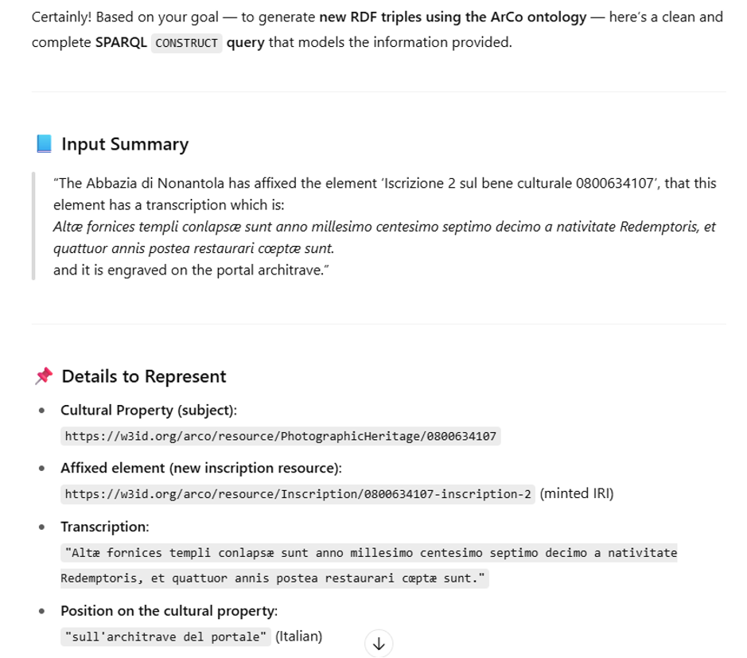

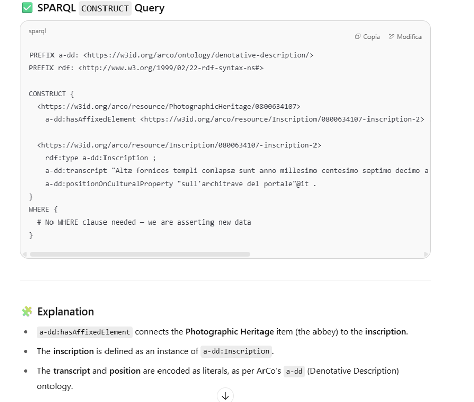


### COPY OF THE SPARQL CONSTRUCT QUERY:

```sparql
PREFIX a-dd: <https://w3id.org/arco/ontology/denotative-description/>
PREFIX rdf: <http://www.w3.org/1999/02/22-rdf-syntax-ns#>
CONSTRUCT {
  <https://w3id.org/arco/resource/PhotographicHeritage/0800634107> 
    a-dd:hasAffixedElement <https://w3id.org/arco/resource/Inscription/0800634107-inscription-2> .
 
  <https://w3id.org/arco/resource/Inscription/0800634107-inscription-2> 
    rdf:type a-dd:Inscription ;
    a-dd:transcript "Altæ fornices templi conlapsæ sunt anno millesimo centesimo septimo decimo a nativitate Redemptoris, et quattuor annis postea restaurari cœptæ sunt." ;
    a-dd:positionOnCulturalProperty "sull'architrave del portale"@it .
}
WHERE {
  # No WHERE clause needed — we are asserting new data
}
```

### RESULT OBTAINED RUNNING CHAT GPT’S SPARQL CONSTRUCT QUERY:

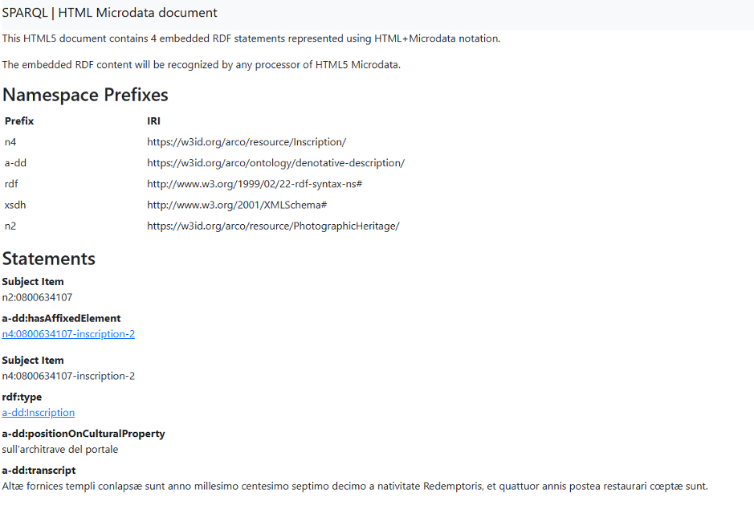

[Gemini](https://gemini.google.com/app)

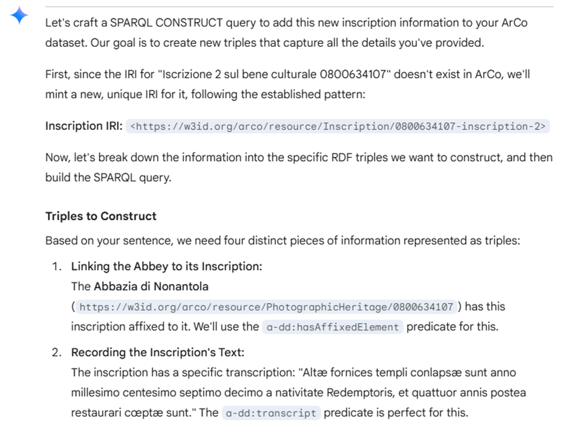

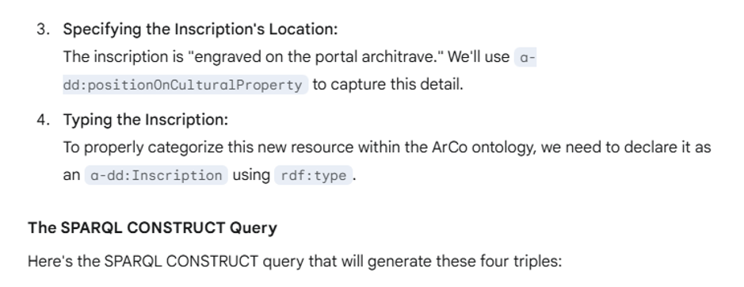

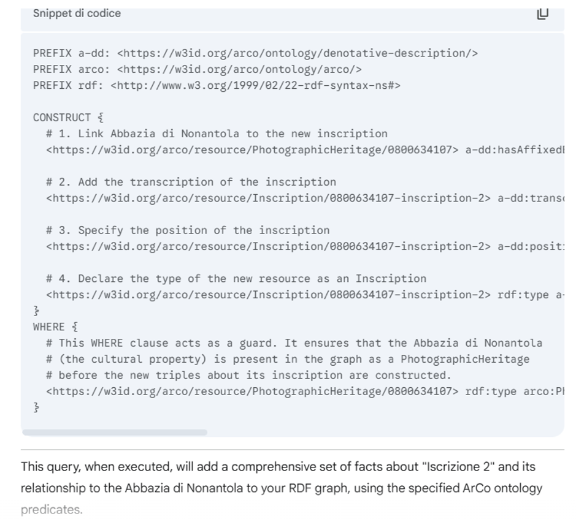

### RESULT OBTAINED EXECUTING THE QUERY ON SPARQL:

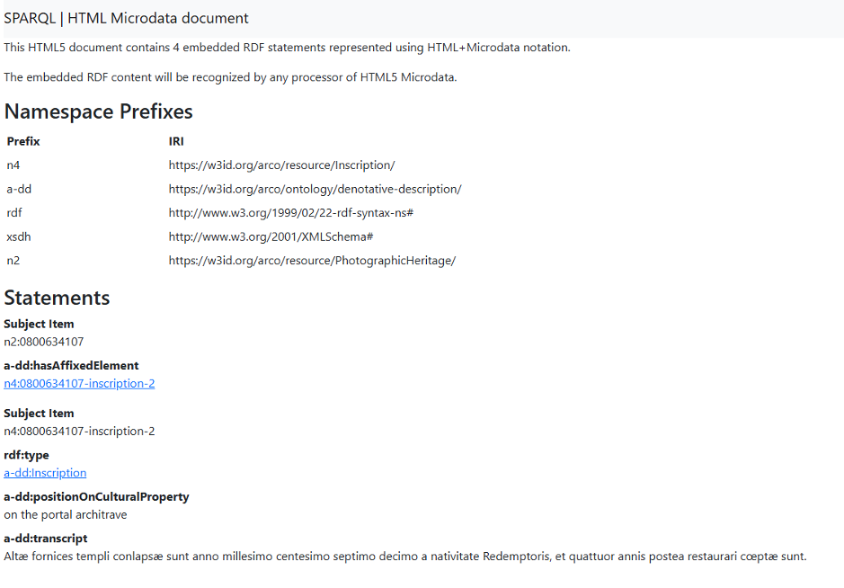

## 4. Triple of the fourth missing information 

We started from the fact that there is only one abbey in Nonantola (see “Fourth missing information” in Step 3 above), therefore the cultural property beginning with “Leoni stilofori” (IRI Portale )  should make clear reference to the Abbey of Nonantola, not only “abbazia” in general.

### PROMPT:

> Hey, could you help me in building a triple? The context is Nonantola Abbey, I want to create a connection (through a triple) between "leoni stilofori"
> belonging to the Abbey, because it is not specified in Arco.
> Here the IRI: subject: https://w3id.org/arco/resource/HistoricOrArtisticProperty/0800221017-0 + predicate =arco:isCulturalPropertyComponentOf + object =
> https://w3id.org/arco/resource/PhotographicHeritage/0800634107

[ChatGPT](https://chatgpt.com/)

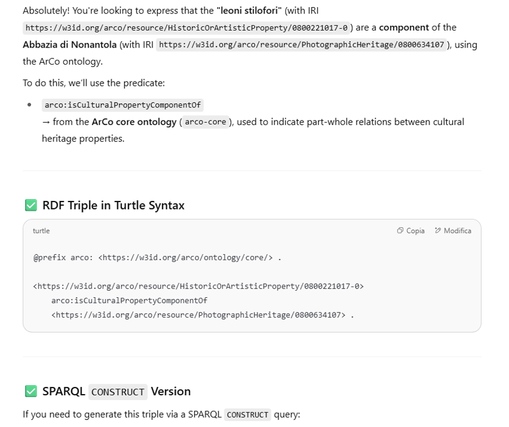

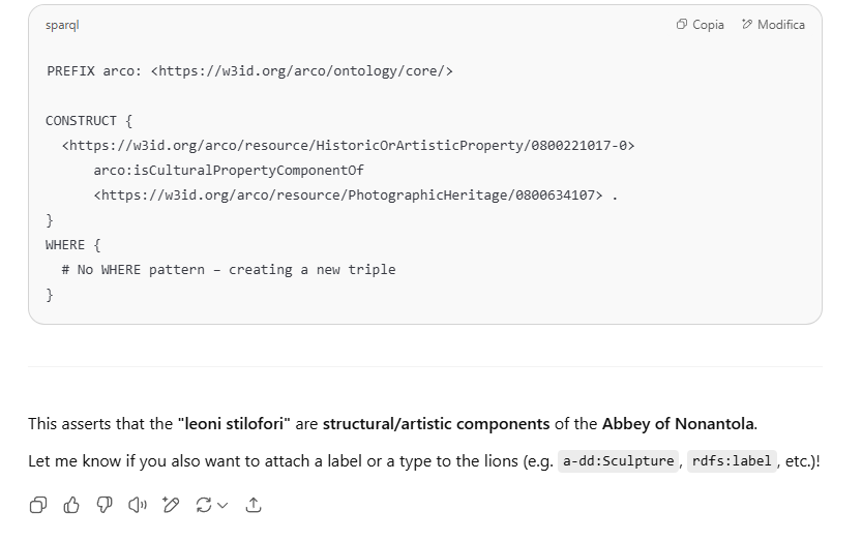

## RESULT OBTAINED RUNNING THE QUERY IN SPARQL: 

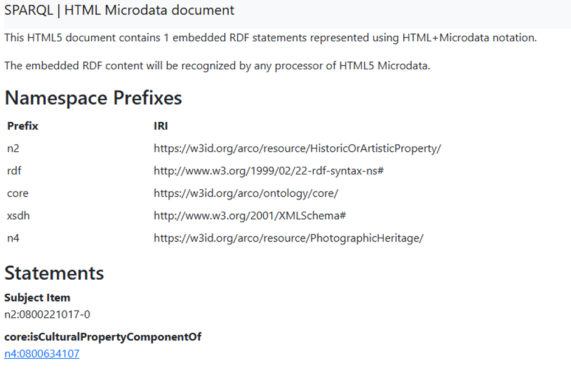

[Gemini](https://gemini.google.com/app)

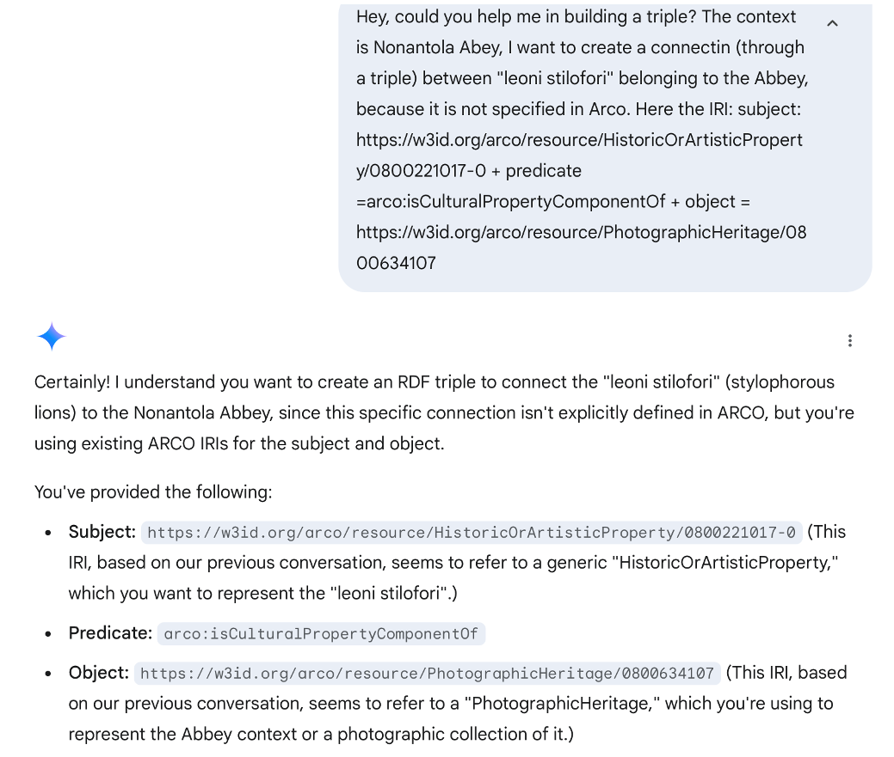

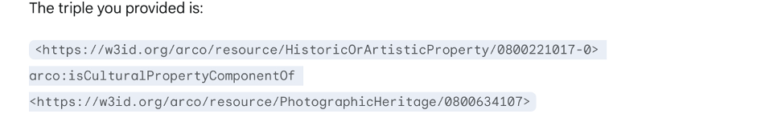

N.B: in this case, we haven’t provided any examples before making our request because we already had all the IRIs.

### 📊 ANALYSIS OF THE RESULTS OF THE CONSTRUCTION OF THE QUERIES: 

•	Both [ChatGPT](https://chatgpt.com/) and [Gemini](https://gemini.google.com/app) always gave correct answers, even if they differ in format and clarity; [ChatGPT](https://chatgpt.com/) tends to give longer and step-by-step answers

•	In some cases they used different prefixes but always justifying their choice: for example, the prefix used by [ChatGPT](https://chatgpt.com/) for the predicate of the first triple was arco-core (together with :hasAlternativeDenomination), while [Gemini's](https://gemini.google.com/app) one was a-dd.

•	[ChatGPT](https://chatgpt.com/) gave us more detailed answers, often adding more information than requested in the prompt; for example, in the first prompt, it also made us a SPARQL CONSTRUCT query that was not necessary and provided the resulting triple in **standard Turtle syntax** (short for **Terse RDF Triple Language**, a syntax used to write **RDF data in a human-readable and compact format**), along with a **clear natural language explanation**. It is a longer RDF representation, compared to the one provided by [Gemini](https://gemini.google.com/app).

•	On the other hand, [Gemini](https://gemini.google.com/app) always answered precisely to what we had requested, without adding anything else. It was more concise and did not ask to propose examples. For example, in the second triple, it was more concise and straight to the point, without proposing additional, as [ChatGPT](https://chatgpt.com/) did, for instance in “Optionals: add labels or types” (second new triple), by defining “Sant’Anselmo” as Agent.


### 🔗TRIPLES SUMMARY

*Triple 1 - `a-cd:hasAlternativeDenomination`* 

> Subject: [https://w3id.org/arco/resource/HistoricOrArtisticProperty/0100210793](https://dati.beniculturali.it/lodview-arco/resource/HistoricOrArtisticProperty/0100210793.html)
> 
> Predicate: `hasAlternativeDenomination`
> 
> Object: Abbazia di San Silvestro (literal)

*Triple 2 - `a-cd:hasCommittent`*

> Subject: [https://w3id.org/arco/resource/HistoricOrArtisticProperty/0100210793](https://dati.beniculturali.it/lodview-arco/resource/HistoricOrArtisticProperty/0100210793.html)
> 
> Predicate: `a-cd:hasCommittent`
> 
> Object: Sant’Anselmo di Nonantola (IRI - needs to be created, not present in ArCo)

*Triple set 3*

*Triple 3.1 - `a-dd:hasAffixedElement`*

> Subject: [https://w3id.org/arco/resource/HistoricOrArtisticProperty/0100210793](https://dati.beniculturali.it/lodview-arco/resource/HistoricOrArtisticProperty/0100210793.html)
> 
> Predicate: `a-dd:hasAffixedElement`
> 
> Object: “Hic locus Domini est, firmiter fundatus est” (this type of class - a-dd:Inscriptions - are represented as “literals”)

*Triple 3.2 - `a-dd:hasAffixedElement`*

> Subject: [https://w3id.org/arco/resource/HistoricOrArtisticProperty/0100210793](https://dati.beniculturali.it/lodview-arco/resource/HistoricOrArtisticProperty/0100210793.html)
> 
> Predicate: `a-dd:hasAffixedElement`
> 
> Object: “Altæ fornices templi conlapsæ sunt anno millesimo centesimo septimo decimo a nativitate Redemptoris, et quattuor annis postea restaurari cœptæ sunt” ((this type of class - a-dd:Inscriptions - are represented as “literals”)

*Triple 4* - `arco:isCulturalPropertyComponentOf`

> Subject: [https://w3id.org/arco/resource/HistoricOrArtisticProperty/0800221017-0](https://dati.beniculturali.it/lodview-arco/resource/HistoricOrArtisticProperty/0800221017-0.html)
> 
> Predicate: `arco:isCulturalPropertyComponentOf`
> 
> Object: [https://w3id.org/arco/resource/PhotographicHeritage/0800634107](https://dati.beniculturali.it/lodview-arco/resource/PhotographicHeritage/0800634107.html)


