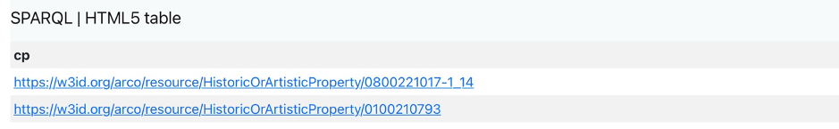
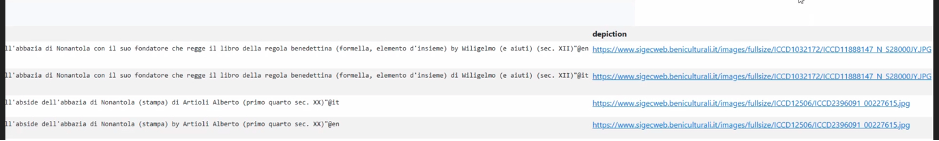
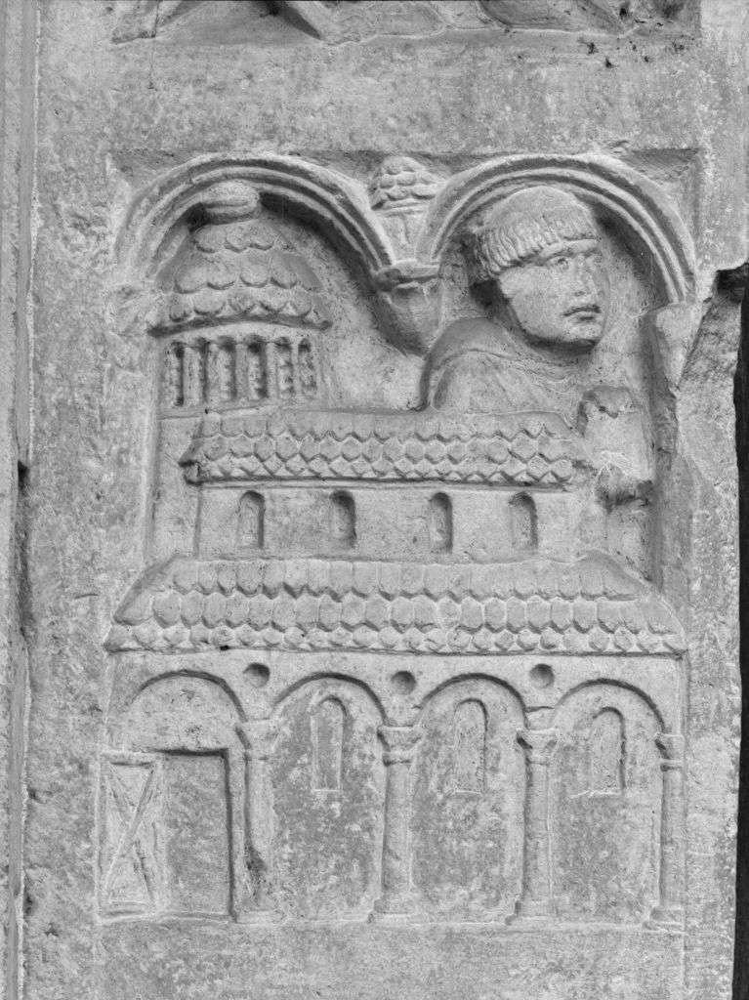
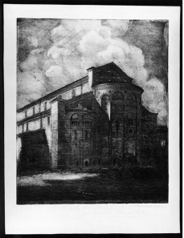
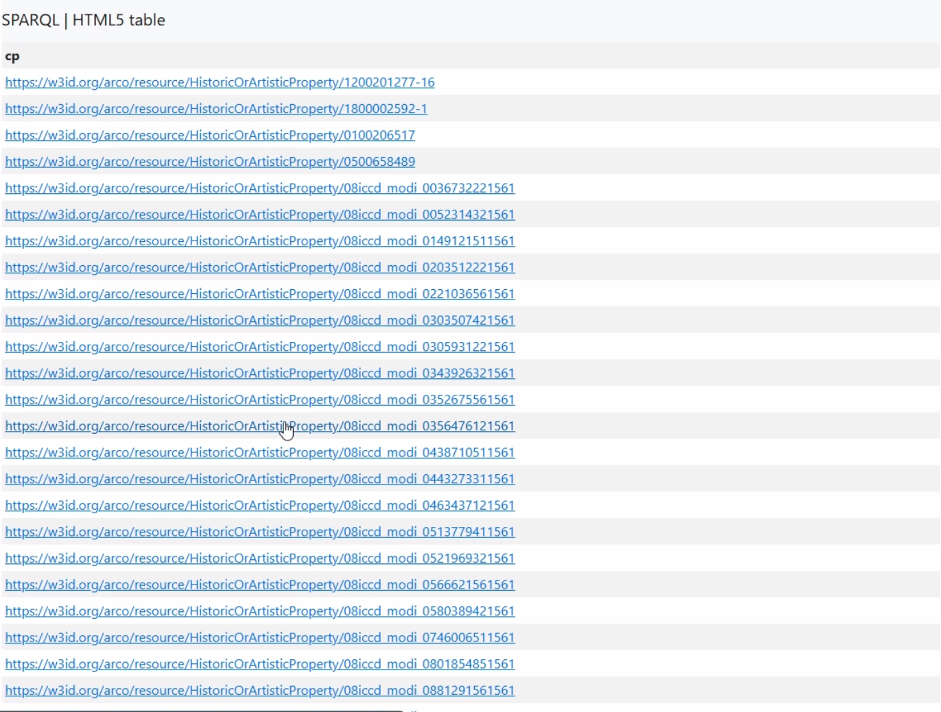

<div style="text-align: center; margin-bottom: 20px;">
  <a href="index.html">🏠 Home</a> |
  <a href="topic.html">🏛️ Topic</a> |
  <a href="methodology.html">⚒️ Methodology</a> |
  <a href="gaps.md">🔍 Identifying Gaps</a> |
  <a href="prompts.md">💬 LLM Prompts</a> |
  <a href="triples.md">🔗 RDF Triples</a> |
  <a href="challenges.md">⚠️ Challenges</a> |
  <a href="conclusion.md">✅ Conclusion</a>
</div>

# RESEARCH ABOUT OUR TOPIC

## Query 1 — Does ArCo contain our topic?

The first step was to verify whether the ArCo Knowledge Graph already contains an entity representing our selected topic, **[Abbazia di Nonantola](https://dati.beniculturali.it/lodview-arco/resource/HistoricOrArtisticProperty/0100210793.html)**.

### Explanation of keywords used:
- **`DISTINCT`**: eliminates duplicate results.
- **`FILTER`** and **`REGEX`**: used to retrieve more specific information. `FILTER` restricts results based on conditions; `REGEX` enables pattern matching inside string values.
- **`cp`**: stands for Cultural Property.

### 🔍 SPARQL Query:

```sparql
PREFIX rdf: <http://www.w3.org/1999/02/22-rdf-syntax-ns#>
 PREFIX arco: <https://w3id.org/arco/ontology/arco/>
 PREFIX a-cd: <https://w3id.org/arco/ontology/context-description/>

 SELECT DISTINCT ?cp
 WHERE {
 ?cp a arco:HistoricOrArtisticProperty ;
 rdfs:label ?l .
 FILTER(REGEX(?l, "Abbazia di Nonantola", "i")
 }
```

### ✅ Results:
The query confirmed that ArCo does contain entities related to our topic. These IRIs will be very useful as subjects for the RDF triples we plan to create with new enriched data.

### 📸 Screenshot of Results



### 🧾 IRIs Found
[Formella](https://dati.beniculturali.it/lodview-arco/resource/HistoricOrArtisticProperty/0800221017-1_14.html)
[Veduta abside](https://dati.beniculturali.it/lodview-arco/resource/HistoricOrArtisticProperty/0100210793.html)

---

## Query 2 — Finding depictions of the Abbazia

In this query, we aimed to find **visual representations** (e.g., images) of **[Abbazia di Nonantola](https://dati.beniculturali.it/lodview-arco/resource/HistoricOrArtisticProperty/0100210793.html)**.  
We used the **`OPTIONAL`** keyword to retrieve data only if available (i.e., if a depiction exists). We removed `DISTINCT` and used `*` to obtain all possible variables in the results.

### Explanation of keywords used:
- **`OPTIONAL`**: allows inclusion of additional data (e.g., depictions) if they are available, without excluding results where this information is missing.
- **`*`**: retrieves all available variables for each match.
- **Two `FILTER(REGEX)`**: allow us to narrow down results using both terms "Abbazia" and "Nonantola".

---

### 🔍 SPARQL Query:

```sparql
PREFIX rdf: <http://www.w3.org/1999/02/22-rdf-syntax-ns#>
PREFIX rdfs: <http://www.w3.org/2000/01/rdf-schema#>
PREFIX arco: <https://w3id.org/arco/ontology/arco/>
PREFIX a-cd: <https://w3id.org/arco/ontology/context-description/>
PREFIX foaf: <http://xmlns.com/foaf/0.1/>

SELECT * 
WHERE { 
  ?cp a arco:HistoricOrArtisticProperty ; 
      rdfs:label ?l .
  FILTER(REGEX(?l, "Abbazia", "i"))
  FILTER(REGEX(?l, "Nonantola", "i"))
  OPTIONAL { ?cp foaf:depiction ?depiction }
}
```

### ✅ Results
The query returned the same IRIs found in Query 1, but this time it included depictions. These are useful for enriching the knowledge graph with visual content.

### 📸 Screenshot of Results



🖼️ Depictions Found




---

## Query 3 — Identifying subjects related to the Abbazia

This query was designed to find **unique resources** that are classified as **Subjects** in the **[ArCo ontology](http://wit.istc.cnr.it/arco/)**, and whose labels include the words **"Abbazia"** and **"Nonantola"**.

By doing this, we hoped to uncover more nuanced ways the abbey is referenced in the ArCo dataset.

---

### 🧠 Explanation of keywords used:
- **`a-cd:Subject`**: specifies that the query is looking for resources of type "Subject" in the ArCo context description ontology.
- **`rdfs:label`**: retrieves the label or name associated with that subject.
- **`FILTER(REGEX)`**: narrows down the results to only those that contain both "Abbazia" and "Nonantola".

---

### 🔍 SPARQL Query:

```sparql
PREFIX a-cd: <https://w3id.org/arco/ontology/context-description/>
PREFIX rdfs: <http://www.w3.org/2000/01/rdf-schema#>

SELECT DISTINCT ?subject ?label
WHERE {
  ?subject a a-cd:Subject ;
           rdfs:label ?label .

  FILTER (REGEX(?label, "Abbazia", "i"))
  FILTER (REGEX(?label, "Nonantola", "i"))
}
```

### ✅ Results
Thanks to this query, we found that the Abbazia di Nonantola is also known as "Abbazia di San Silvestro".
This alternative name is highly relevant and valuable for enriching its semantic description in the knowledge graph.

### 🖼️ Screenshot of Results


### 🧾 IRIs of Subjects Found
[Subject 1](https://w3id.org/arco/resource/Subject/39118c7749e95831e607fa945beb9278)

[Subject 2](https://w3id.org/arco/resource/Subject/9a1f6896bfa19393dbe4b1c276a4919d)

[Subject 3](https://w3id.org/arco/resource/Subject/c17e71b0d26dba752b65e19fd7bef43c)

---

## Query 4 — Using UNION to retrieve multiple naming patterns

In this query, we explored the possibility that **"Abbazia di Nonantola"** and **"Abbazia di San Silvestro"** might refer to the same cultural property, but be labeled differently in ArCo.

We used the keyword **`UNION`** to capture **either** name. This helps us find alternative naming patterns that could reveal duplicated or misclassified entries.

---

### 🧠 Explanation of keyword used:
- **`UNION`**: allows combining two different patterns in a single query. If either pattern matches, the result is included. It’s useful for comparing multiple naming conventions or label variations.

---

### 🔍 SPARQL Query:

```sparql
PREFIX rdf: <http://www.w3.org/1999/02/22-rdf-syntax-ns#>
PREFIX arco: <https://w3id.org/arco/ontology/arco/>
PREFIX a-cd: <https://w3id.org/arco/ontology/context-description/>

SELECT DISTINCT ?cp
WHERE {
  {
    ?cp a arco:HistoricOrArtisticProperty ;
        rdfs:label ?l .
    FILTER(REGEX(?l, "Abbazia di Nonantola", "i"))
  }
  UNION
  {
    ?cp a arco:HistoricOrArtisticProperty ;
        rdfs:label ?l .
    FILTER(REGEX(?l, "Abbazia di San Silvestro", "i"))
  }
}
```

### ✅ Results
The query returned the same two IRIs found in Query 1, which means that "Abbazia di San Silvestro" does not exist as a Cultural Property (cp), only as a Subject (as seen in Query 3). This confirms that ArCo represents only one cultural property under the IRI for Abbazia di Nonantola.

---

## Query 5 — General search for “Abbazia” entities

After gathering specific data about **Abbazia di Nonantola**, we wanted to broaden our research by exploring **other abbeys** within the ArCo ontology. This comparison could help us identify **additional information** that might be missing from our abbey's description.

We ran a query using only the word **“abbazia”**, expecting many results. For that reason, we added the keyword `LIMIT` to avoid overloading the output.

---

### 🧠 Explanation of keyword used:
- **`FILTER(REGEX(?l, "abbazia", "i"))`**: searches all labels that contain the word “abbazia”, case-insensitive.
- **`LIMIT 50`**: restricts the number of results returned to the first 50 matches, for efficiency and readability.

---

### 🔍 SPARQL Query:

```sparql
PREFIX rdf: <http://www.w3.org/1999/02/22-rdf-syntax-ns#> 
PREFIX arco: <https://w3id.org/arco/ontology/arco/> 
PREFIX a-cd: <https://w3id.org/arco/ontology/context-description/> 

SELECT DISTINCT ?cp 
WHERE {  
  ?cp a arco:HistoricOrArtisticProperty ;  
       rdfs:label ?l .  
  FILTER(REGEX(?l, "abbazia", "i"))  
}
LIMIT 50
```

### ❌ Results

Unfortunately, the query returned mostly repetitive results:

## Out of 50 entities retrieved, 46 were related to the same abbey — Abbazia di Nonantola — and thus the query was not useful for our comparison goal.

This led us to design a more specific query focusing on the vocabulary of properties.

### 🖼️ Screenshot of Results



---

## Query 6 — Investigating used properties for “abbazia”

The aim of this query was to understand **which properties and values** are commonly used to describe entities labeled as **"abbazia"** in the ArCo dataset. This would help us identify **vocabulary** we might use to enrich the description of **Abbazia di Nonantola**.

To explore the RDF structure in detail, we queried the **predicate-object pairs** (property/value) related to abbeys, and we sorted the results using `ORDER BY`.

---

### 🧠 Explanation of keywords used:
- **`?property ?value`**: returns the predicate-object pairs of each abbey entity.
- **`ORDER BY DESC(?property)`**: sorts the results alphabetically in descending order by property name.
- **`FILTER(REGEX(?l, "abbazia", "i"))`**: ensures the results are limited to abbeys.

This allowed us to then **search manually** (using CTRL+F) for terms like *"committent"*, *"style"*, etc., which are **missing** in the current IRI of Abbazia di Nonantola.

---

### 🔍 SPARQL Query:

```sparql
PREFIX rdf: <http://www.w3.org/1999/02/22-rdf-syntax-ns#> 
PREFIX arco: <https://w3id.org/arco/ontology/arco/> 
PREFIX a-cd: <https://w3id.org/arco/ontology/context-description/>
PREFIX cis: <http://dati.beniculturali.it/cis/> 

SELECT DISTINCT ?property ?value 
WHERE {  
  ?cp a arco:HistoricOrArtisticProperty ; 
      rdfs:label ?l ; 
      ?property ?value .  
  FILTER(REGEX(?l, "abbazia", "i"))  
}  
ORDER BY DESC(?property)
```

### 📊 Results
The query generated a long list of predicate-object pairs related to various abbeys. We used this list as a reference vocabulary, checking for concepts that could enrich our target entity.

Among the missing aspects we looked for were:

- Who commissioned the abbey (committent)
- Architectural style
- Historical function or symbolic meaning

### 📌 A full discussion of this analysis is available in the section: [Identifying Gaps](gaps.md) page.
